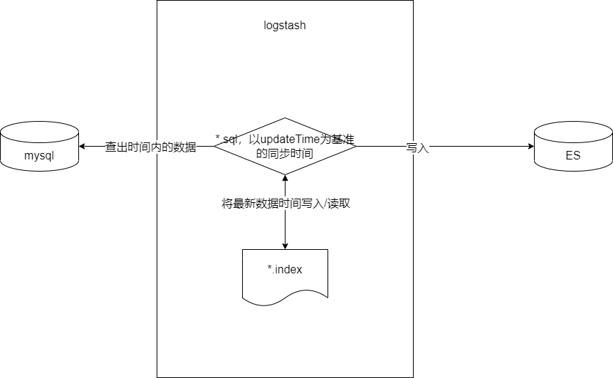

### 使用版本
- elasticsearch 7.17.5
- logstash 7.17.5
- kibana 7.17.5

### 使用docker部署es和kibana
~~~yml
# es和kibana docker-compose.yml
version: '3'
services:
  kibana:
    image: kibana:7.17.5
    container_name: kibana7
    environment:
      - I18N_LOCALE=zh-CN
      - XPACK_GRAPH_ENABLED=true
      - TIMELION_ENABLED=true
      - TZ=Asia/Shanghai
    volumes:
      - ./elasticsearch/kibana/kibana.yml:/usr/share/kibana/config/kibana.yml
    ports:
      - "5601:5601"
    deploy:
      resources:
        limits:
          memory: 512M
    depends_on:
      - elasticsearch
    links:
      - elasticsearch

  elasticsearch:
    image: elasticsearch:7.17.5
    container_name: elasticsearch
    environment:
      - cluster.name=es-main
      - "ES_JAVA_OPTS=-Xms1000m -Xmx4000m"
      - discovery.type=single-node
      - TZ=Asia/Shanghai
      - TAKE_FILE_OWNERSHIP=true
      - ELASTIC_PASSWORD=Az@123456
      - http.cors.enabled=true
      - http.cors.allow-origin=*
      - http.cors.allow-headers=Authorization,X-Requested-With,Content-Length,Content-Type
    volumes:
      - ./elasticsearch/data:/usr/share/elasticsearch/data
      - ./elasticsearch/logs:/usr/share/elasticsearch/logs
      - ./elasticsearch/conf/elasticsearch.yml:/usr/share/elasticsearch/config/elasticsearch.yml
    ports:
      - "9200:9200"
      - "9300:9300"
    expose:
      - 9200
      - 9300
    deploy:
      resources:
        limits:
          memory: 4096M
~~~

#### 准备配置文件 elasticsearch.yml和kibana.yml
~~~yml
# 准备elasticsearch.yml
network.host: 0.0.0.0
#跨域支持
http.cors.enabled: true
#跨域访问允许的域名地址
http.cors.allow-origin: "*"
#开启xpack
xpack.security.enabled: true
xpack.license.self_generated.type: basic
xpack.security.transport.ssl.enabled: true
#证书配置
xpack.security.transport.ssl.verification_mode: certificate
xpack.security.transport.ssl.client_authentication: required
xpack.security.transport.ssl.keystore.path: elastic-certificates.p12
xpack.security.transport.ssl.truststore.path: elastic-certificates.p12
~~~

~~~yml
# kibana.yml
#设置中文显示
i18n.locale: "zh-CN"
 
#设置访问用户
elasticsearch.username: "elastic"
#设置访问密码
elasticsearch.password: "Az@123456"
 
#ElasticSearch连接地址
elasticsearch.hosts: ["http://elasticsearch:9200"]
 
#IP访问地址和端口号
server.host: "0.0.0.0"
server.port: 5601
~~~

### 部署logstash
~~~yml
version: '3'
services:
  logstash:
    image: logstash:7.17.5
    container_name: logstash
    environment:
      - TZ=Asia/Shanghai
    volumes:
      - ./mysql:/usr/share/logstash/mysql
      - ./config/logstash.yml:/usr/share/logstash/config/logstash.yml
      - ./conf.d:/usr/share/logstash/config/conf.d
      - ./template:/usr/share/logstash/template
      - ./logs:/usr/share/logstash/logs
    expose:
      - 5044
      - 9600
    deploy:
      resources:
        limits:
          memory: 3000M
~~~

#### 配置logstash.yml
~~~yml
http.host: "0.0.0.0"
xpack.monitoring.enabled: true
xpack.monitoring.elasticsearch.hosts: "http://elasticsearc7:9200"  #es地址
xpack.monitoring.elasticsearch.username: "elastic"  #es xpack账号密码
xpack.monitoring.elasticsearch.password: "Az@123456"     #es xpack账号密码
path.config: /usr/share/logstash/config/conf.d/*.conf
path.logs: /usr/share/logstash/logs
~~~

#### 在conf.f文件夹下创建同步的配置 mysql_to_es.conf
~~~conf
# mysql_to_es.conf

input{

    # 实有人口
    jdbc {
	  type => "mysql-to-es"
      # mysql相关jdbc配置
      jdbc_connection_string => "jdbc:mysql://192.168.7.11:19001/grid_collection?useUnicode=true&characterEncoding=utf8&useSSL=false&useLegacyDatetimeCode=false&serverTimezone=Asia/Shanghai&nullCatalogMeansCurrent=true"
      jdbc_user => "root"
      jdbc_password => "cc123456"
 
      # jdbc连接mysql驱动的文件
      #jdbc_driver_library => "/usr/share/logstash/logstash-core/lib/jars/mysql-connector-java-5.1.49.jar"
      jdbc_driver_library => "/usr/share/logstash/mysql/mysql-connector-java-5.1.49.jar"
      jdbc_driver_class => "com.mysql.jdbc.Driver"
      jdbc_paging_enabled => "true"
	  jdbc_paging_mode => "explicit" # 手动分页
      jdbc_fetch_size => "2000" # 每次查2000后即插入ES，避免OOM
      jdbc_page_size => "2000"
	  
 
      # mysql文件, 也可以直接写SQL语句在此处，如下：
      statement_filepath => "/usr/share/logstash/mysql/mysql-to-es.sql"
 
      # 这里类似crontab,可以定制定时操作，比如每10分钟执行一次同步(分 时 天 月 年)
      schedule => "*/10 * * * * *"
      # 是否将字段名转换为小写，默认true（如果有数据序列化、反序列化需求，建议改为false）
      lowercase_column_names => false
      # 处理中文乱码问题
      codec => plain { charset => "UTF-8" }
      # 使用其它字段追踪，而不是用时间
      use_column_value => true
      # 追踪的字段  这个字段只有在上面的lowercase_column_names配置为false的时候才会区分大小写  因为不配置为false的话默认是true  查询结果字段默认会变成全小写；   我这里使用的是更新时间
      tracking_column => "updatedTime"
      # 这个就是追踪字段的类型，只有数值和时间两个类型(numeric和timestamp，默认numeric) 这个值会记录到last_run_metadata_path 配置的文件中 如果配置是numeric 那么默认值为0 如果配置为timestamp 那么默认值为1970年
      tracking_column_type => "timestamp"
      # 记录上一次运行记录
      record_last_run => true
      # 上一个sql_last_value值的存放文件路径, 必须要在文件中指定字段的初始值  这个就是增量数据同步的关键
      last_run_metadata_path => "/usr/share/logstash/mysql/ga_syfwdjxx_to_es.index"
      # 是否清除 last_run_metadata_path 的记录,如果为true那么每次都相当于从头开始查询所有的数据库记录
      clean_run => false
      # 这个type可以用来做多个输入源和多个输出源区分  这里举例所以只有一个
    }

}
filter{
			#if[type] == "loginlog"{
			#    grok {
			#		match => {"message" => "|%{GREEDYDATA:loginMsg}|%{GREEDYDATA:timeFormat}|%{GREEDYDATA:userName}"}
			#	}
			#	if([message] =~  "^(?!.*?登录系统).*$") {
			#		### 丢弃
			#		drop{}
			#	   }
			#	}
			#if[type] == "datalog"{	
			#	grok {
			#		match => {"message" => "|%{DATA:userName}|%{GREEDYDATA:operationName}|%{DATA:timeFormat}|%{DATA:ip}|%{DATA:systemType}|%{GREEDYDATA:logType}|%{GREEDYDATA:method}|%{GREEDYDATA:input}"}
			#	}	
			#}
            #ruby {
			#	code => "event['time'] = event['@timestamp']"
			#}
			#mutate
			#{
			#	add_field => ["time", "%{@timestamp}"]
			#}				 
}
output{

	if[type] == "mysql-to-es"{
		elasticsearch{
			hosts=>["elasticsearch:9200"]
			user => "elastic"
			password => "Az@123456"
			index => "mysql-to-es" # 插入的index
			#将"_id"的值设为mysql的主键
			document_type => "_doc"
			document_id => "%{id}"
			manage_template => true
			template_overwrite => true
      # 同步时创建的使用的mapping模板
			template_name => "mysql-to-es"
			template => "/usr/share/logstash/template/mysql-to-es.json"
		}
	}
}

~~~

#### 用于同步数据的实例sql
~~~sql
SELECT
	id as id,
	name as name,
	dept_name as deptName,
	updated_time as updatedTime
FROM
	test_table
WHERE
-- updated_time后面必须跟< now()，否则高并发下可能会漏同步数据
	updated_time > date_add(:sql_last_value,INTERVAL 8 HOUR) and updated_time < now()
LIMIT :size OFFSET :offset

~~~
  
